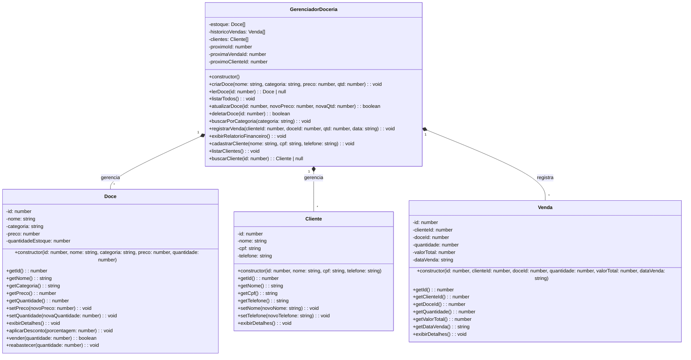

# Doceria Gourmet 

## Estrutura de Arquivos

```text
bd/
├── src/
│   ├── models/           (Equivalente aos headers/cpp de Cliente, Doce, Venda)
│   │   ├── Cliente.ts
│   │   ├── Doce.ts
│   │   └── Venda.ts
│   ├── services/         (Equivalente ao GerenciadorDoceria)
│   │   └── GerenciadorDoceria.ts
│   └── index.ts          (Equivalente ao main.cpp)
├── package.json          (Configuração do projeto Node.js)
├── tsconfig.json         (Configuração do compilador TypeScript)
└── README.md
```

## Como Executar

1. Certifique-se de ter o [Node.js](https://nodejs.org/) instalado.
2. No diretório raiz (`bd/`), instale as dependências:
   ```bash
   npm install
   ```
3. Para rodar o projeto em modo de desenvolvimento:
   ```bash
   npm run dev
   ```
4. Para compilar e rodar a versão de produção:
   ```bash
   npm run build
   npm start
   ```

## Notas da Conversão
- A entrada de dados foi adaptada de `cin` para o módulo `readline` do Node.js usando `async/await`.
- As classes foram organizadas em pastas `models` e `services` para seguir as melhores práticas de TypeScript/Node.js.
- A lógica de IDs incrementais e vetores foi mantida idêntica à original.


---

