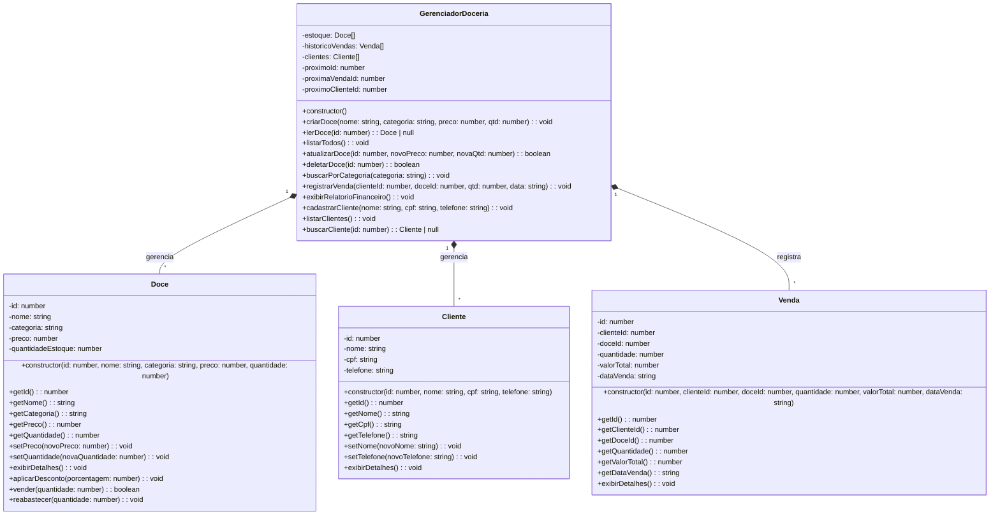

---
config:
  theme: redux-dark
---

```mermaid
classDiagram

class Cliente {
    -id: number
    -nome: string
    -cpf: string
    -telefone: string
    +constructor(id: number, nome: string, cpf: string, telefone: string)
    +getId(): number
    +getNome(): string
    +getCpf(): string
    +getTelefone(): string
    +setNome(novoNome: string): void
    +setTelefone(novoTelefone: string): void
    +exibirDetalhes(): void
}

class Doce {
    -id: number
    -nome: string
    -categoria: string
    -preco: number
    -quantidadeEstoque: number
    +constructor(id: number, nome: string, categoria: string, preco: number, quantidade: number)
    +getId(): number
    +getNome(): string
    +getCategoria(): string
    +getPreco(): number
    +getQuantidade(): number
    +setPreco(novoPreco: number): void
    +setQuantidade(novaQuantidade: number): void
    +exibirDetalhes(): void
    +aplicarDesconto(porcentagem: number): void
    +vender(quantidade: number): boolean
    +reabastecer(quantidade: number): void
}

class Venda {
    -id: number
    -clienteId: number
    -doceId: number
    -quantidade: number
    -valorTotal: number
    -dataVenda: string
    +constructor(id: number, clienteId: number, doceId: number, quantidade: number, valorTotal: number, dataVenda: string)
    +getId(): number
    +getClienteId(): number
    +getDoceId(): number
    +getQuantidade(): number
    +getValorTotal(): number
    +getDataVenda(): string
    +exibirDetalhes(): void
}

class GerenciadorDoceria {
    -estoque: Doce[]
    -historicoVendas: Venda[]
    -clientes: Cliente[]
    -proximoId: number
    -proximaVendaId: number
    -proximoClienteId: number
    +constructor()
    +criarDoce(nome: string, categoria: string, preco: number, qtd: number): void
    +lerDoce(id: number): Doce | null
    +listarTodos(): void
    +atualizarDoce(id: number, novoPreco: number, novaQtd: number): boolean
    +deletarDoce(id: number): boolean
    +buscarPorCategoria(categoria: string): void
    +registrarVenda(clienteId: number, doceId: number, qtd: number, data: string): void
    +exibirRelatorioFinanceiro(): void
    +cadastrarCliente(nome: string, cpf: string, telefone: string): void
    +listarClientes(): void
    +buscarCliente(id: number): Cliente | null
}

GerenciadorDoceria "1" *-- "*" Doce : gerencia
GerenciadorDoceria "1" *-- "*" Cliente : gerencia
GerenciadorDoceria "1" *-- "*" Venda : registra
```